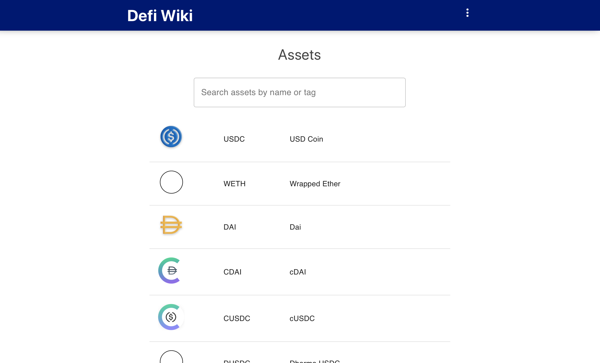
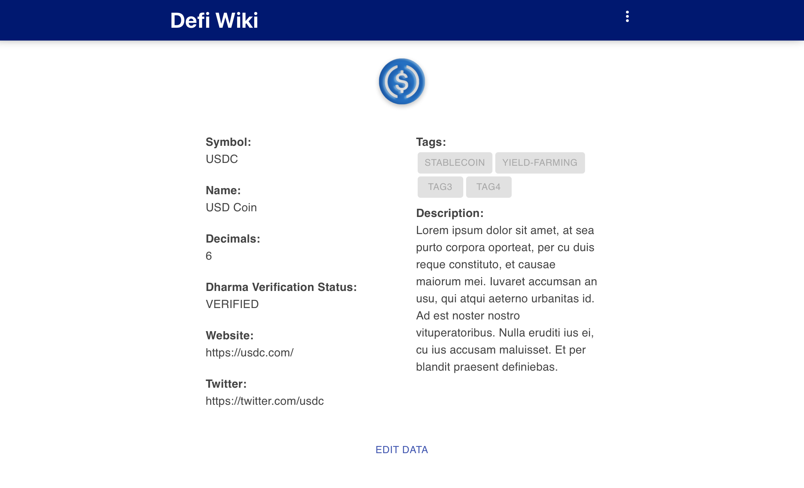
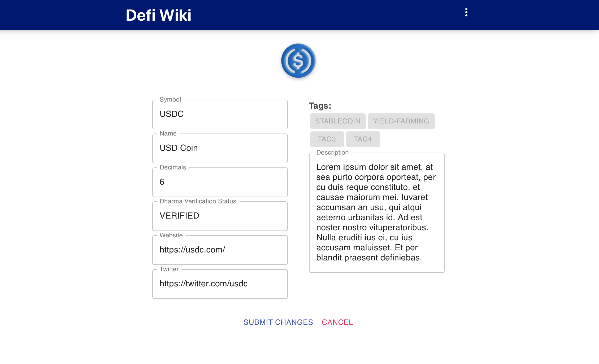
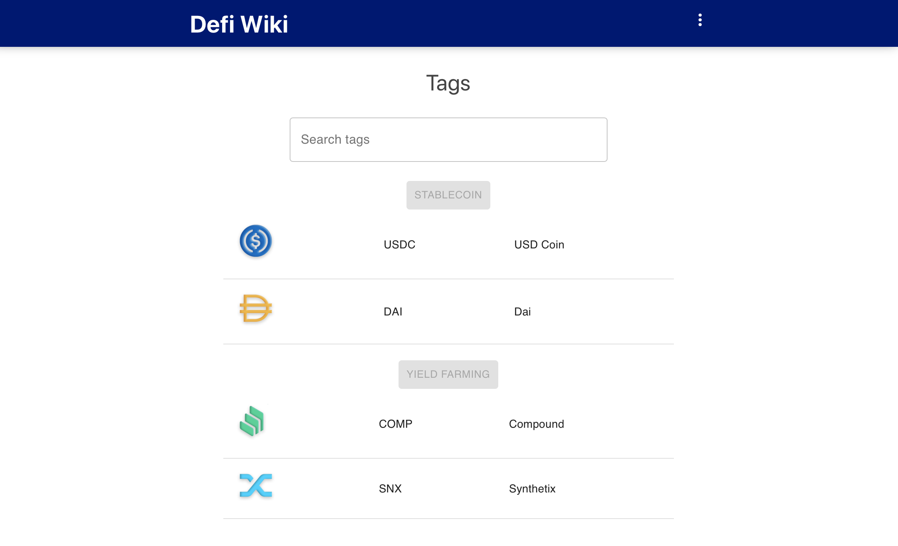

## Design Proposal

# Home:

# Token Detail:

# Edit Token:

# Tags:

# Github oAuth and Submit Changes:
To make possible the creation of a PR by the user, you need write access to all publics repos of the user, I think this increases the onboarding friction and many users maybe will deny it.

The strategy suggested implies using only one fork and making many branches (one per user submit) i.e. named feat_[username]_[timestamp] and tagging the username in the PR description.

## This is the workflow in detail:

1. The user "Bob01" tap Submit changes.
2. Authenticate with GitHub is shown to the user (only login permissions).
3. If it's successful, the server clones the the defi-wiki repo in a folder named "changes/Bob01".
4. The server creates a new branch named Bob01_[timestamp] , Updates the json files and finally creates a PR with @ Bob01 in the description.
